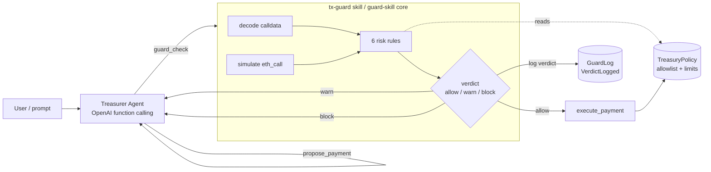

# Pharos Guard — tx-guard

[](https://github.com/henessay/pharos-agent/actions/workflows/ci.yml)

> A **transaction firewall** for AI agents on Pharos. An agent with a wallet is
> one bad prompt away from draining a treasury; tx-guard puts a deterministic
> gate in front of every transaction — simulate, decode, score six risk rules,
> check the on-chain treasury policy, and return **allow / warn / block** before
> anything is signed — then logs the verdict on-chain for a tamper-evident audit
> trail. Submission for the **Pharos AI Agent Carnival — Phase 1 (Skill Hackathon)**.

One firewall, three surfaces: a **Pharos Skill**, an **MCP server**, and a demo
**treasurer agent** — all backed by `TreasuryPolicy` + `GuardLog` contracts on
the Pharos testnet (chain id `688689`).

## Quick start

```bash
pnpm install
pnpm build
pnpm test     # 95 tests: contracts (forge) + guard-skill + agent (vitest)
```

Then try the firewall offline (no RPC, no keys) via the demo agent's fixtures:

```bash
pnpm --filter @pharos-guard/agent test     # dialog flow on mocked GuardReports
```

> **Prerequisites:** Node ≥ 20, pnpm 10, and [Foundry](https://getfoundry.sh)
> for the contracts. If Foundry is absent, contract build/test steps skip
> gracefully so the JS pipeline still runs.

## How it works



The six rules: **SIM_REVERT**, **UNLIMITED_APPROVE**, **UNVERIFIED_CONTRACT**,
**FIRST_INTERACTION**, **POLICY_VIOLATION**, **HIGH_VALUE**. Explorer-dependent
rules degrade gracefully (skipped, never fatal) when the API is unavailable.

## Layout

```
pharos-guard/
├── packages/
│   ├── contracts/      # Foundry: TreasuryPolicy.sol + GuardLog.sol (tests, deploy)
│   └── guard-skill/    # core: risk engine, queries, deployments loader, MCP server
├── apps/
│   ├── agent/          # demo treasurer agent (OpenAI function calling, dry-run fixtures)
│   └── web/            # placeholder
├── skill/              # Pharos Skill package (SKILL.md + wrapper scripts)
└── docs/               # skill-format, demo-script, cli-examples, post-deploy-checklist
```

## Use this skill in your Phase 2 agent

tx-guard is built to drop in front of *any* agent. Three integration paths:

**1. As a Pharos Skill** (instruction + wrapper scripts):

```bash
npx skills add /path/to/Pharos-Agent/skill --copy --agent claude-code --skill '*'
```

See [`docs/skill-install.md`](docs/skill-install.md). Your agent then runs
`node skill/scripts/guard-check.mjs --from … --to … --data …` and reads the
JSON verdict.

**2. As an MCP server** (tools `guard_check`, `policy_status`,
`guard_log_history`) — wire it into Claude Desktop / Claude Code:

```jsonc
{
  "mcpServers": {
    "pharos-guard": {
      "command": "node",
      "args": ["/path/to/Pharos-Agent/packages/guard-skill/bin/mcp.mjs"]
    }
  }
}
```

See [`packages/guard-skill/README.md`](packages/guard-skill/README.md).

**3. As a library** — `import { guardTransaction } from "@pharos-guard/guard-skill"`
and gate your own `execute` path on `report.verdict === "allow"` (the demo agent
in [`apps/agent`](apps/agent) does exactly this).

## Pharos Atlantic Testnet

| Parameter | Value |
|-----------|-------|
| Chain id | `688689` (`0xa8231`) |
| RPC URL | `https://atlantic.dplabs-internal.com` |
| Explorer | `https://atlantic.pharosscan.xyz` |
| Native token | `PHRS` (18 decimals) |

Chain def: [`packages/guard-skill/src/chain.ts`](packages/guard-skill/src/chain.ts).
Copy `.env.example` → `.env` to configure RPC / keys / addresses.

## Deploy

```bash
cd packages/contracts
AGENT_ADDRESS=0xYourAgent forge script script/Deploy.s.sol:Deploy \
  --rpc-url "$PHAROS_RPC_URL" --private-key "$PRIVATE_KEY" --broadcast
pnpm sync:deployments   # fills the address tables below from the deploy json
```

### Deployed addresses — Pharos Atlantic Testnet (chain id `688689`)

<!-- deployments:start -->
| Contract | Address | Explorer | Verified |
|----------|---------|----------|----------|
| TreasuryPolicy | `0x479e566B027De29c6640A6234f22Cacb18bBD856` | [view](https://atlantic.pharosscan.xyz/address/0x479e566B027De29c6640A6234f22Cacb18bBD856) | ❌ |
| GuardLog | `0xEe7b59f48A7b688e013104BAF0cDE6DB2F315E47` | [view](https://atlantic.pharosscan.xyz/address/0xEe7b59f48A7b688e013104BAF0cDE6DB2F315E47) | ❌ |
<!-- deployments:end -->

Addresses come only from
`packages/contracts/deployments/pharos-testnet.json` (synced by
`pnpm sync:deployments`); before a deploy the core reports a structured
`contracts_not_deployed` ("deploy pending"). Remaining post-deploy steps:
[`docs/post-deploy-checklist.md`](docs/post-deploy-checklist.md).

## Honest disclosure

The contracts, risk engine, skill, MCP server, and demo agent in this repo were
written during the hackathon period. The approach — a deterministic transaction
firewall that vets agent actions before signing — builds on our prior experience
designing transaction-screening and policy-enforcement systems; that background
informed the design, but the code here is original to this submission. The
contracts are deployed on the Pharos Atlantic Testnet (chain id 688689; see the
address table above); every network-dependent surface degrades to a clear
"deploy pending" state rather than faking results when addresses are absent.

## License

MIT
